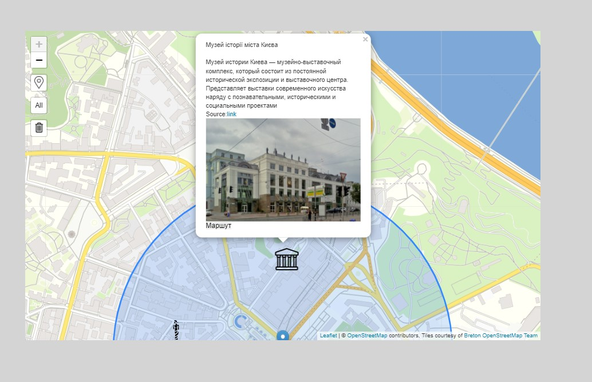
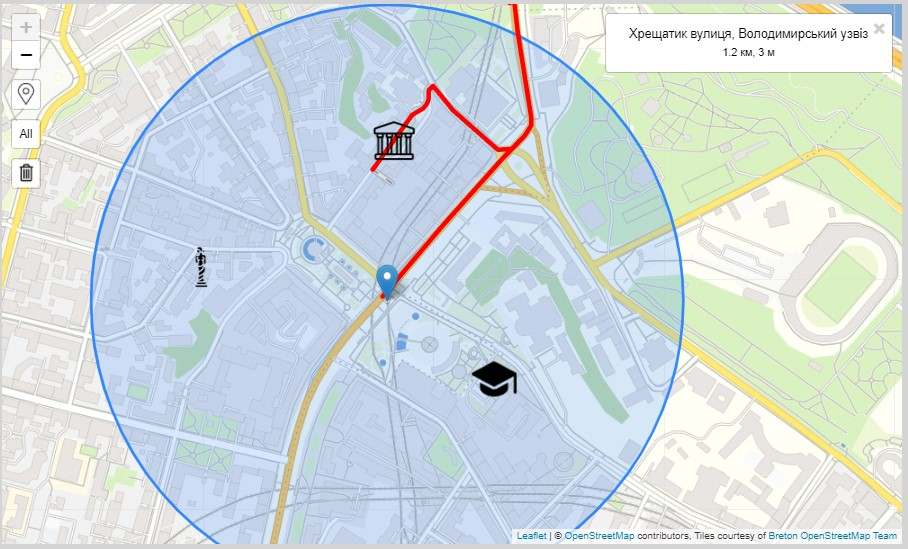

# ІВ-93 Калайда Тарас (<a href="https://github.com/Inspiration679">Inspiration679</a>), Кочерга Андрій(<a href="https://github.com/anrikolo">anrikolo</a>), Лінійчук Данило (<a href="https://github.com/JenyaVozduhaTochkaNet">JenyaVozduhaTochkaNet</a>)
# Map
 + [Описание](#Description);
 + [Структура Сайта](#Site_structure);
 + [Структура проекта](#Site_project);
 + [Доступно](#Available)
 + [Планы](#Plans);
 + [Примеры работы](#Example);

# Описание
- Приложение для справочной информации о близлежащих обьектах на карте

# Структура Сайта
- Главная страница
  - Карта
  - Всплывающее меню с информацией об обьекте
  - Список обьектов относительно позиции камеры
- Информация
  - Список источников данных
  - Слои карты
# Структура проекта  
- MapVersion1  

  - About  
    - templates (для страницы about)  
    - __init__.py  
    - apps.py  
    - test.py  
    - urls.py  
    - views.py 

  - Map    
    - templates (для страницы Map)  
    - __init__.py  
    - apps.py  
    - test.py  
    - models.py  
    - views.py  
    - admin.py  

   - LastVersionDjango (Главный файл с настройками сервера)  
     - __init__.py  
     - urls.py (включает все остальные пути)  
     - views.py (содержит mixin класс для других views.py)  
     - settings.py (настройки сервера)  
     - asgi.py  
     - wsgi.py  
  
  - templates (для head, body, header, footer)  
  
  - static  
    - js  
    - css  
    - img  

  - requirments.txt 

  - Dockerfile

  - docker-compose

  - .gitignore  

  - db.sqlite3 

  - manage.py 
  
# Доступно
- Отображение:
  -  карты с маркерами 
  -  текущего местоположения
  -  доступных маркеров относительно местоположения
  -  по категориям 
  -  маркера с информацией 
- Доступные категории:
  - Библиотека
  - Музей
  - Университет
  - Монумент
- Страничка "About"
- Регистрация/логин
- Добавление маркеров для зарегистрированных пользователей
- Построение маршрута
  
# Планы
- Авто. заполнение бд
- Увеличить количество доступных маркеров и категорий
- Улучшить определение местоположения и отслеживание перемещения

# Примеры работы

## Местоположение с областью видимости и маркерами

## Если маркер не находиться в области видимости 

## Содержание маркера

## Отобразить все доступные маркеры

## Интерфейс зарегистрированного пользователя

## Добавить метку от пользователя

## Отображение маркеров пользователя

## Построение маршрута

